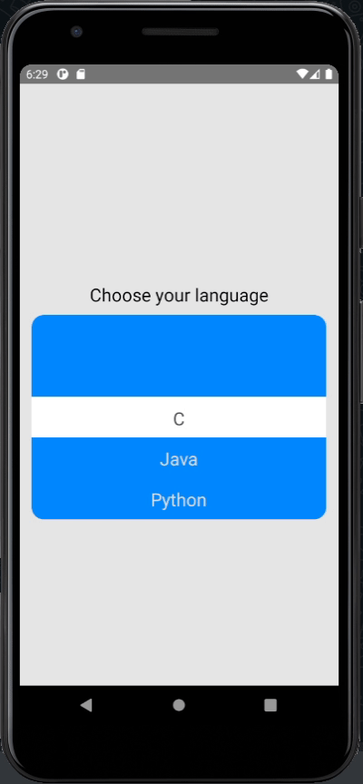
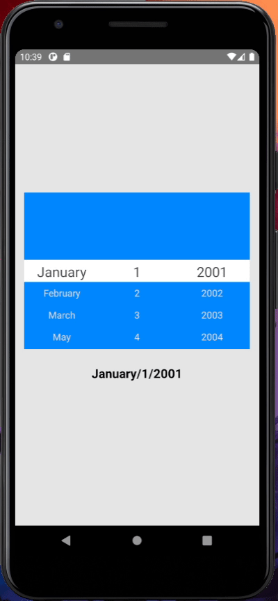

[](https://github.com/semantic-release/semantic-release)


# roll-picker-native

An alternative to ScrollView on React Native.

The `roll-picker-native` is just a way better to see a ScrollView with some customizations.

### Examples



### Install

`yarn add roll-picker-native`

`npm install roll-picker-native`

`expo install roll-picker-native`

### Basic Usage

Import `roll-picker-native`

````js
import RollPickerNative from 'roll-picker-native'
````

```js
<RollPickerNative
  items={['item1', 'item2', 'item3', 'item4', 'item5']}
  index={month}
  onIndexChange={(index: number) => console.log('month', index)}
/>
```

#### Code sample

````js
import React, { useCallback, useState } from 'react'
import RollPickerNative from 'roll-picker-native'
import { Text, View } from 'react-native'

const App = () => {
  const days = Array.from({ length: 30 }, (_, i) => (i + 1).toString())
  const years = Array.from({ length: 30 }, (_, i) => {
    if (i < 9) return '200' + (i + 1).toString()
    return '20' + (i + 1).toString()
  })

  const months = [
    'January',
    'February',
    'March',
    'May',
    'April',
    'June',
    'July',
    'August',
    'September',
    'October',
    'November',
    'December'
  ]
  const [year, setYear] = useState(0)
  const [month, setMonth] = useState(0)
  const [day, setDay] = useState(0)

  const handleRoll = useCallback((field: string, index: number) => {
    switch (field) {
      case 'month': {
        setMonth(index)
        break
      }
      case 'day': {
        setDay(index)
        break
      }
      case 'year': {
        setYear(index)
        break
      }
    }
  }, [])

  return (
    <View
      style={{
        flex: 1,
        justifyContent: 'center',
        alignItems: 'center',
        paddingHorizontal: 15,
        backgroundColor: '#e5e5e5'
      }}
    >
      <View
        style={{
          width: '100%',
          flexDirection: 'row'
        }}
      >
        <RollPickerNative
          items={months}
          index={month}
          onIndexChange={(index: number) => handleRoll('month', index)}
          selectHeight={35}
          containerHeight={250}
          selectTextStyle={{
            fontSize: 22
          }}
        />
        <RollPickerNative
          items={days}
          index={day}
          onIndexChange={(index: number) => handleRoll('day', index)}
          selectHeight={35}
          containerHeight={250}
          selectTextStyle={{
            fontSize: 22
          }}
        />
        <RollPickerNative
          items={years}
          index={year}
          onIndexChange={(index: number) => handleRoll('year', index)}
          selectHeight={35}
          containerHeight={250}
          selectTextStyle={{
            fontSize: 22
          }}
        />
      </View>
      <Text
        style={{
          paddingVertical: 25,
          fontSize: 20,
          fontWeight: 'bold'
        }}
      >
        {months[month]}/{days[day]}/{years[year]}
      </Text>
    </View>
  )
}

export default App

````
### Props

| Name            | Type                    | Default      | Description                         |
|-----------------|-------------------------|--------------|-------------------------------------|
| items           | string[]                | **Required** | Items of roll picker                |
| label           | string                  | undefined    | Label title of component            |
| labelStyle      | TextStyle               | undefined    | Style of label                      |
| index           | number                  | **Required** | index of roll picker                |
| onIndexChange   | (index: number) => null | undefined    | Return index when scroll is stopped |
| containerHeight | number                  | 200          | Height of container                 |
| selectHeight    | number                  | 20           | Height of item and box select       |
| itemStyle       | ViewStyle               | undefined    | Style of items not selected         |
| itemTextStyle   | TextStyle               | undefined    | Style of text each item             |
| selectStyle     | ViewStyle               | undefined    | Style of item selected              |
| selectTextStyle | TextStyle               | undefined    | Style text of item selected         |
| lineColor       | ViewStyle.borderColor   | 'white'      | Color of border top and bottom      |
| removeLine      | boolean                 | false        | Remove border top and bottom        |
